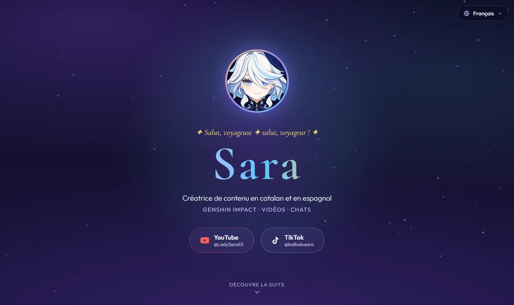

# ✦ Sara

Site vitrine de **Sara**, créatrice de contenu Genshin Impact en català et castellà.

**→ [sarabalbalu.github.io/Sara](https://sarabalbalu.github.io/Sara/)**

[](https://github.com/SaraBalbalu/Sara/actions/workflows/deploy.yml)



## Ce qu'on y trouve

- Les dernières vidéos et Shorts de la [chaîne YouTube](https://www.youtube.com/@LadySara01), mis à jour tout seuls
- Le fil [TikTok](https://www.tiktok.com/@balbalusara) intégré
- Une vitrine Genshin Impact — stats de jeu et personnages, détaillés au clic
- La galerie des chats de la maison 🐾
- Quatre langues — català · español · English · français — détectées automatiquement

## Sous le capot

Site entièrement statique, sans backend : [React](https://react.dev) + [Vite](https://vite.dev),
CSS maison, aucune bibliothèque d'interface.

Les données sont regénérées deux fois par jour par GitHub Actions, puis servies en JSON :
le flux RSS de la chaîne pour les vidéos, [Enka.Network](https://enka.network) pour le profil
Genshin. Aucune clé d'API n'est nécessaire.

## Développement

```bash
npm install
npm run dev          # serveur local
npm run build        # build de production
npm run fetch-data   # rafraîchit les données YouTube et Genshin
```

---

Site de fans, sans affiliation avec HoYoverse — Genshin Impact et ses ressources appartiennent à HoYoverse.
Fait avec 💜 pour Sara.
